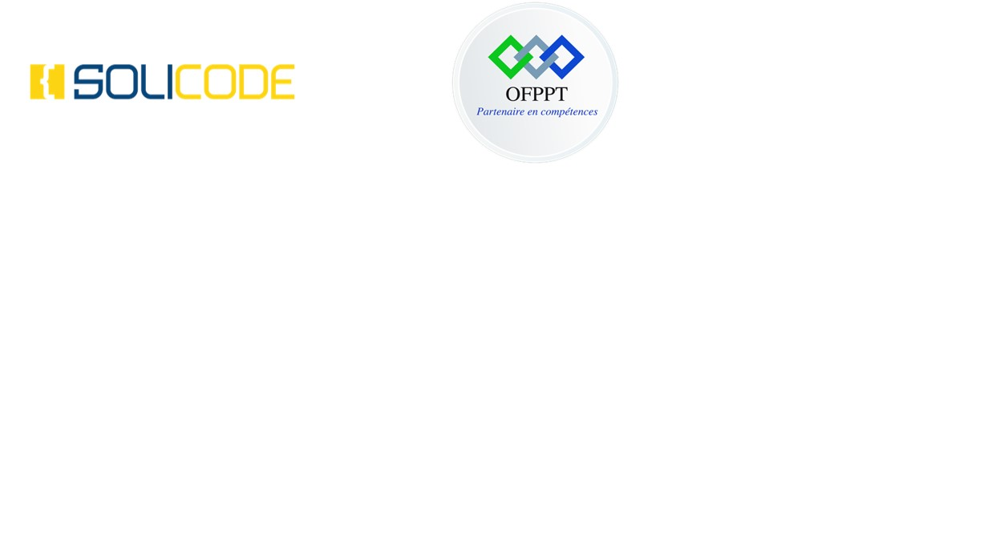

# Projet CNMH : Rapport Projet cnmh

---
## **Application cnmh**
### *digitalisation des documents*
---
**Étudiant(e) :** *hussein bouik*
**Date de Remise :** *1/19/2024*
**Encadré(e) par :** *Essaraj Fouad*
---
### **Programme d'Études :** *Development Mobile*
### **Établissement :** *Solicode*
### **Année Académique :** *2023-2024*
---
<!-- 

 -->

# Plan du Rapport

1. [Listes des Figures](#listes-des-figures) <!-- Page 2 -->
2. [Remerciement](#remerciement) <!-- Page 5 -->
3. [Introduction](#introduction) <!-- Page 6 -->
   - [Contexte du Projet](#contexte-du-projet) <!-- Page 7 -->
   - [Cahier des Charges](#cahier-des-charges) <!-- Page 7 -->
   - [Diagramme de Contexte](#diagramme-de-contexte) <!-- Page 8 -->
   - [Objectifs de Formation](#objectifs-de-formation) <!-- Page 8 -->
   - [Développement Agile](#developpement-agile) <!-- Page 10 -->
     - [Méthode Agile](#methode-agile) <!-- Page 10 -->
     - [Scrum](#scrum) <!-- Page 11 -->
   - [Processus de Développement](#processus-de-developpement) <!-- Page 12 -->
     - [2TUP](#2tup) <!-- Page 12 -->
     - [Design Thinking](#design-thinking) <!-- Page 13 -->
   - [Planification](#planification) <!-- Page 15 -->
     - [Gestion des Tâches](#gestion-des-taches) <!-- Page 15 -->
     - [Diagramme de Gantt](#diagramme-de-gantt) <!-- Page 15 -->
   - [Branche Fonctionnelle](#branche-fonctionnelle) <!-- Page 16 -->
     - [Pôle Social](#pole-social) <!-- Page 16 -->
     - [Pôle Médical](#pole-medical) <!-- Page 17 -->
     - [Pôle Sport](#pole-sport) <!-- Page 22 -->
   - [Diagramme de Cas d’Utilisation CNMH](#diagramme-de-cas-dutilisation-cnmh) <!-- Page 24 -->
   - [Branche Technique](#branche-technique) <!-- Page 25 -->
     - [Architecture de l'Application](#architecture-de-lapplication) <!-- Page 25 -->
     - [Analyse Technique](#analyse-technique) <!-- Page 26 -->
     - [Prototype](#prototype) <!-- Page 26 -->
   - [Conception](#conception) <!-- Page 28 -->
     - [Diagramme de Classes](#diagramme-de-classes) <!-- Page 29 -->
     - [Maquettes](#maquettes) <!-- Page 30 -->
   - [Réalisation](#realisation) <!-- Page 31 -->
     - [Sprints](#sprints) <!-- Page 31 -->
     - [Technologies](#technologies) <!-- Page 31 -->
     - [Outils](#outils) <!-- Page 32 -->
     - [Interface](#interface) <!-- Page 33 -->
4. [Conclusion](#conclusion) <!-- Page 34 -->
5. [Annexe A : Maquettes](#annexe-a--maquettes) <!-- Page 35 -->
6. [Annexe B : Affectation des Tâches](#annexe-b--affectation-des-taches)

