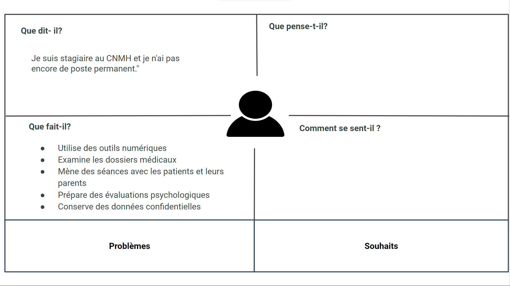

# Rapport

## Carte d’empathie

### Introduction

*Figure 1: Introduction*

### Service Social - Khawla souan

*Figure 2: Service Social - Khawla souan*
## Médecin général Algamot asia

*Figure 3: Médecin général Algamot asia*

## D’empathie d’orthoptiste - Imane Errahmouni

*Figure 4: D’empathie d’orthoptiste - Imane Errahmouni*

## Psychomotricien - Salma LIKRAM

*Figure 5: Psychomotricien - Salma LIKRAM*

## Médecin général Algamot asia

*Figure 6: Médecin général Algamot asia*

## D’empathie d’orthoptiste - Imane Errahmouni

*Figure 7: D’empathie d’orthoptiste - Imane Errahmouni*

## Psychomotricien - Salma LIKRAM

*Figure 8: Psychomotricien - Salma LIKRAM*

## Assistant dentaire spécialiste Interne - Tallaoui sanae

*Figure 9: Assistant dentaire spécialiste Interne - Tallaoui sanae*

## Service de rééducation - Kinésithérapeute - Nassima El Ouazzani

*Figure 10: Service de rééducation - Kinésithérapeute - Nassima El Ouazzani*

## Service de rééducation - Ergothérapeute - Alaoui Ghita

*Figure 11: Service de rééducation - Ergothérapeute - Alaoui Ghita*

## Service de rééducation - Psychologue - Anas Mjadli

*Figure 12: Service de rééducation - Psychologue - Anas Mjadli*

## Service rééducation - orthophoniste - SAMIA KABBAJ

*Figure 13: Service rééducation - orthophoniste - SAMIA KABBAJ*

## Pole sport - (Yassine serhane, Karima bamoussa)

*Figure 14: Pole sport - (Yassine serhane, Karima bamoussa)*

## Responsable de pôle éducatif - Fouad Ichir

*Figure 15: Responsable de pôle éducatif - Fouad Ichir*

## Références

[Carte d’empathie](https://docs.google.com/presentation/d/1WkibTkxVvAtEwSUtbnktpjZTRztYOJby6Cckc1bsjlg/edit)

## Conclusion

# Chapitre 2

# Chapitre 3

La formation est divisée en deux sections :

- Notions préliminaires
- Réalisation des projets

Dans la première section, nous découvrirons certaines notions préliminaires que vous devez savoir avant de commencer à apprendre le développement Web avec HTML5 et CSS3. Nous allons voir dans la première partie,  le concept du Web et d’Internet. Cela va vous donne une compréhension claire du concept d’une page web et sa fonctionnement. La deuxième partie décrit comment installer l’environnement de développement nécessaire pour démarrer les travaux pratiques.
[chapiter](./chapiter1.md)
